Welcome to Shopping_Land  this is a full stack ecommerce project application developed using some of the most popular and efficient technologies in the software development world.
Our backend is built with Java 17 and Spring Boot 3.2.1, providing robust server-side capabilities. 
The database is managed by MySQL, ensuring reliable data storage and retrieval. 
On the frontend, we harness the power of Angular 14 and TypeScript to create a dynamic and responsive user interface
for payment we use stripe api.
for application security we okta platform.

## Technologies

- **Backend:** Java 17, Spring Boot 3.2
- **Database:** MySQL
- **Frontend:** Angular 14, TypeScript

## How I Can Run project immediatly 
- you should have java installed on your machine prefered java 17
- you should have maven installed on your machine
- you should have mysql database installed on your machine
- you should have node js installed on your machine
- you should have angualr cli installed on your machine

** To run project successfully you should create your account in okta platform to generate application with spa type
- then go to my my-app-config.ts and change
- clientId: to your ID
- issuer: to your issuer

** you Should register to Stripe and get public ket and secret key
- put secret key in application.properties in spring application
- put public key in angular project config file

 ** Step 1: Clone the Repository **
- git clone [your-repo-link]
- cd [your-repo-directory]

** Step 2: Backend Setup **
- cd backend
- ./mvnw spring-boot:run

** Step 3: Frontend Setup **
- cd frontend
- npm install
- ng serve
** Step 4: Access the Application **
- With both the backend and frontend running, open your web browser and go to http://localhost:4200. You should now see the application running.

*****Notice*****
- Note: Ensure your MySQL server is running and properly configured as per your application's requirements. Also,
- make sure that any environment-specific configurations (like database connection settings, API keys, etc.)
- are correctly set up before starting the servers.

  
### features

- you have product list , product categories
<figure>
     
    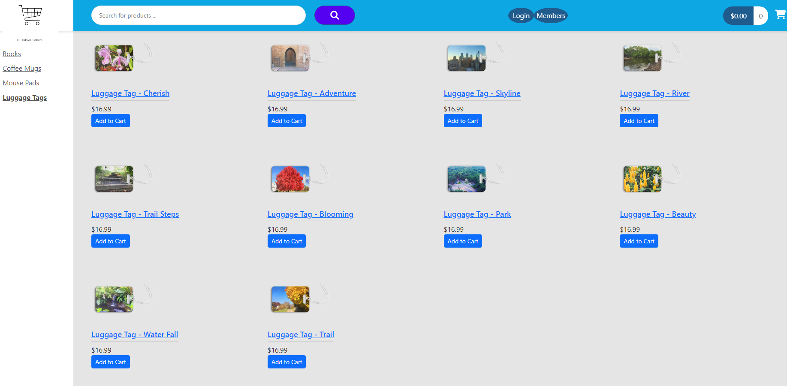
</figure>

- you can login and logout
<figure>
     
    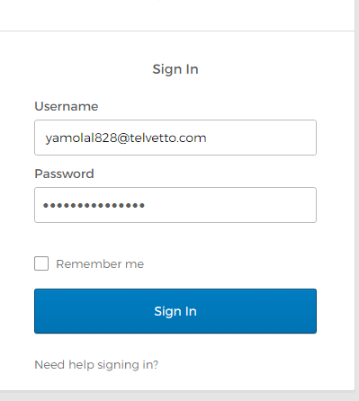
</figure>

- you can search about any product
<figure>
     
    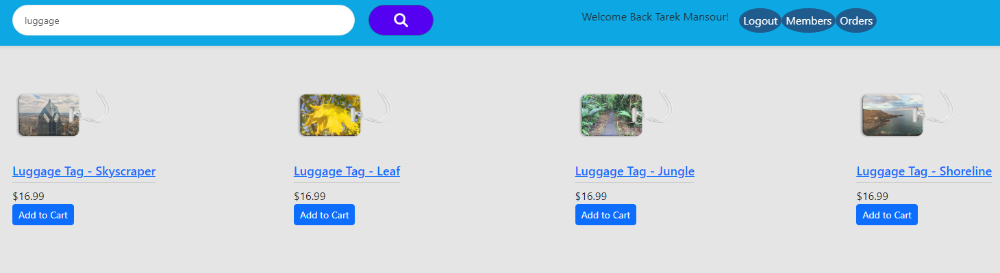
</figure>

- you have feature to paginate pages
<figure>
     
    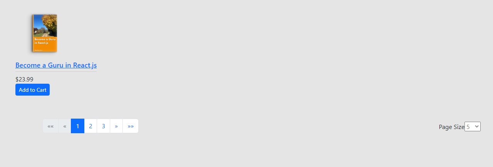
</figure>

- you have orders made by every customers sorted in amazing way
<figure>
     
    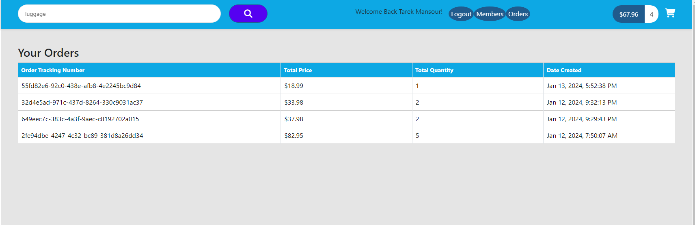
</figure>

- you have vip members
<figure>
     
    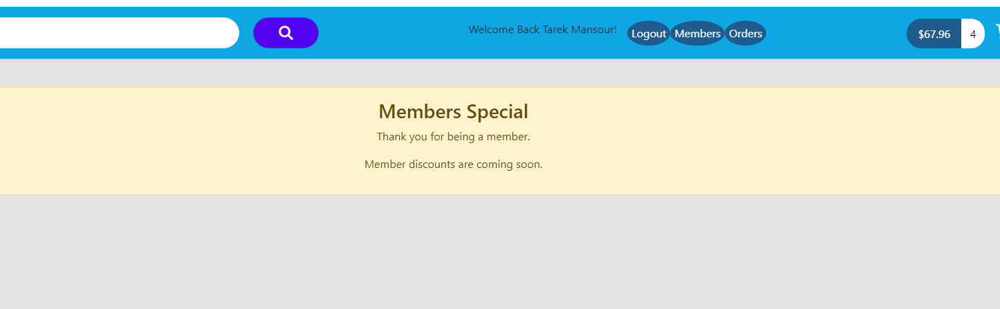
</figure>

- you have shopping cart and you can add any product to it
<figure>
     
    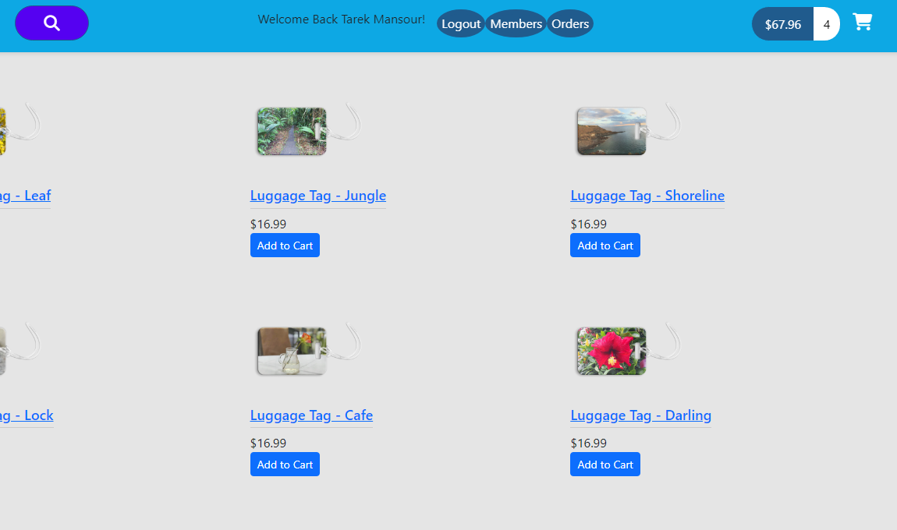
</figure>

- you can modify add or remove products from your shopping cart and make checkout
<figure>
     
    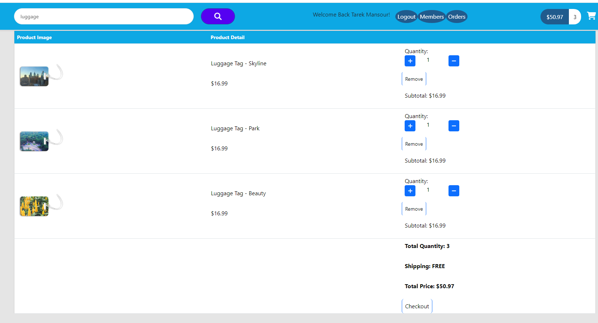
</figure>

- you purchase by you different type of payment method visa or master card
<figure>
     
    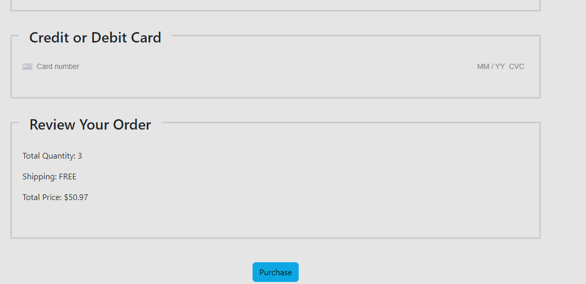
</figure>

- you can choose shipping address and your billing address
<figure>
     
    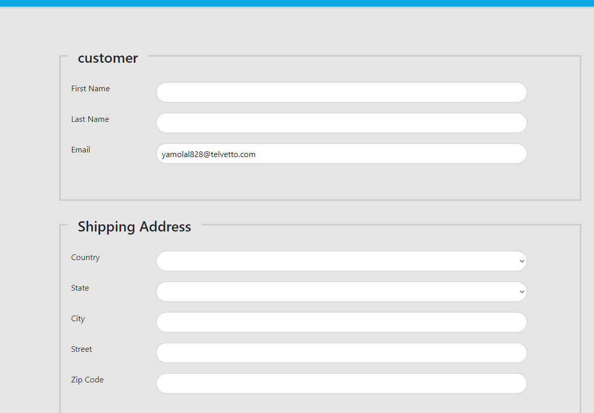
</figure>

-you have order tracking number after verified payment 
<figure>
     
    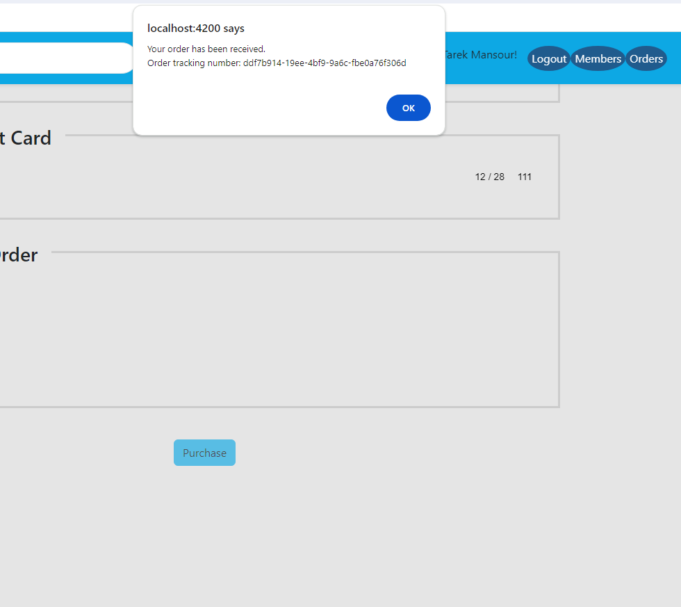
</figure>

- success paymnet in stripe platform
<figure>
     
    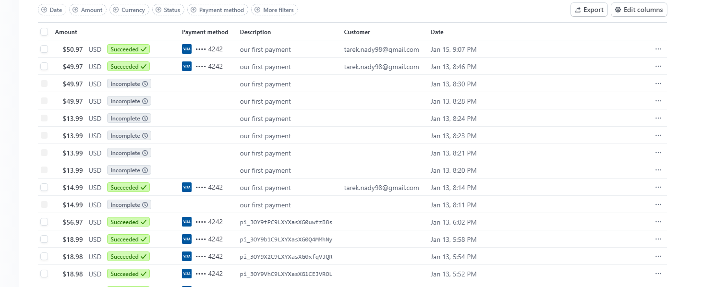
</figure>

- payment stripe in details
<figure>
     
    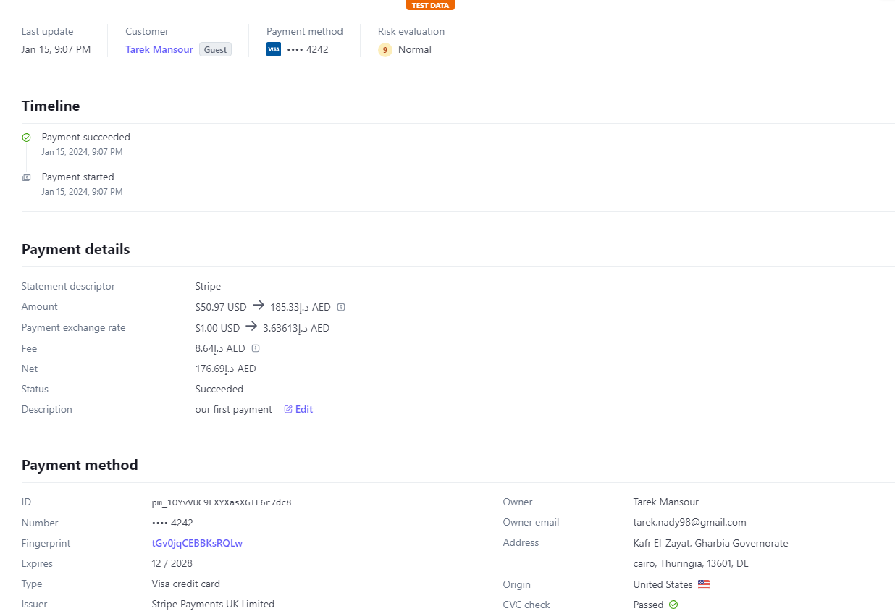
</figure>

## FAQ
- Feel free to ask any questions

## License

This project is licensed under the MIT License - see the [LICENSE](LICENSE) file for details.
